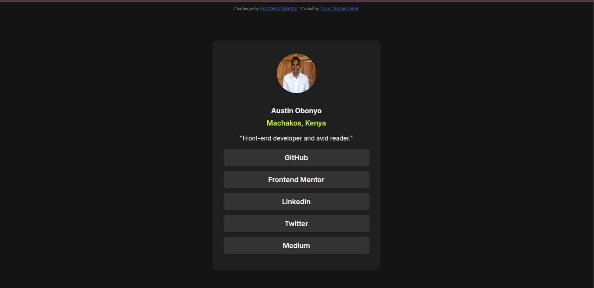
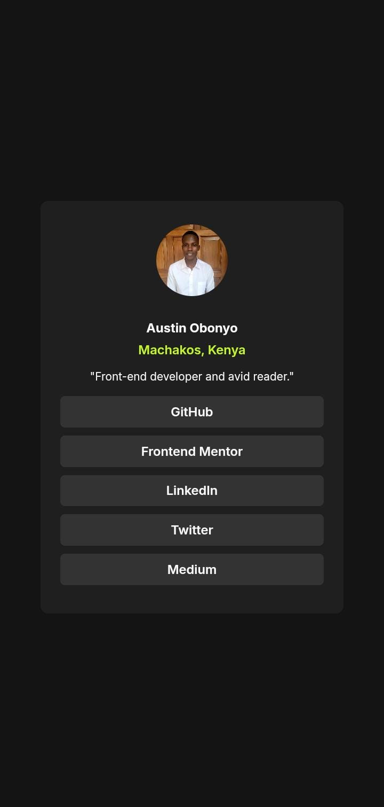

# Frontend Mentor - Social links profile solution

This is a solution to the [Social links profile challenge on Frontend Mentor](https://www.frontendmentor.io/challenges/social-links-profile-UG32l9m6dQ). Frontend Mentor challenges help you improve your coding skills by building realistic projects. 

## 📸 Screenshots

  
  

## 🔗 Links

- 🧠 Solution on Frontend Mentor[Check solution](https://www.frontendmentor.io/solutions/social-links-profile-xt1psGUJ5O)
- 💻 Live Site: [View site](https://social-links-nine-flame.vercel.app/)

## 🛠️ Built With

- Semantic `HTML5`
- `CSS` custom properties
- `Flexbox` and CSS `Grid`
- Responsive layout with a desktop-first approach

## ✨ What I Learned

- How to center content both vertically and horizontally using `Flexbox` and `100vh`
- Applying `box-shadow` and `border` styling for card-like UI elements
- Improved my ability to translate design files into clean, accessible, and responsive codeg)

## 🚀 Areas for Continued Development

In future projects, I aim to:

- Write cleaner and more maintainable CSS
- Get even better at pixel-perfect implementation from design tools like Figma
- Explore BEM naming conventions for better CSS structure

## 📚 Useful Resources

- [w3schools](https://www.w3schools.com/cssref/index.php) - Helpful for understanding CSS properties like `object-fit`, `viewport units`, and `border`.

## 👤 Author

- GitHub - [@Austinjnr](https://github.com/Austinjnr)
- Website - [Austin Obonyo](https://austinobonyo.vercel.app/)
- Frontend Mentor - [@Austinjnr](https://www.frontendmentor.io/profile/Austinjnr)
- Twitter/X - [@AustinWalkker](https://x.com/AustinWalkker)